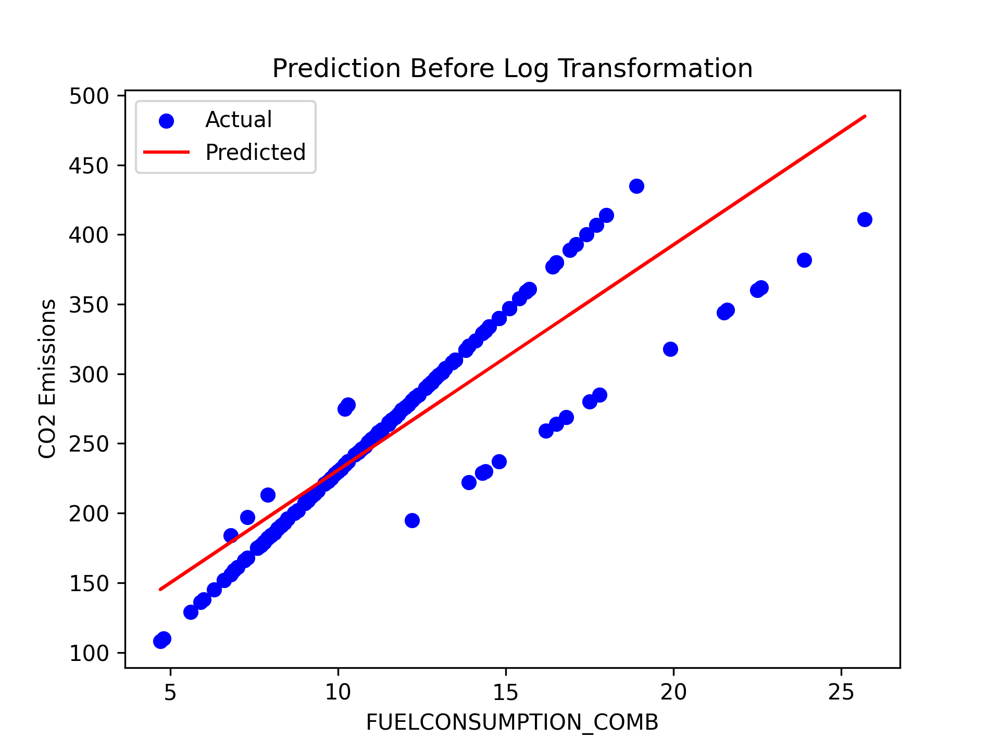
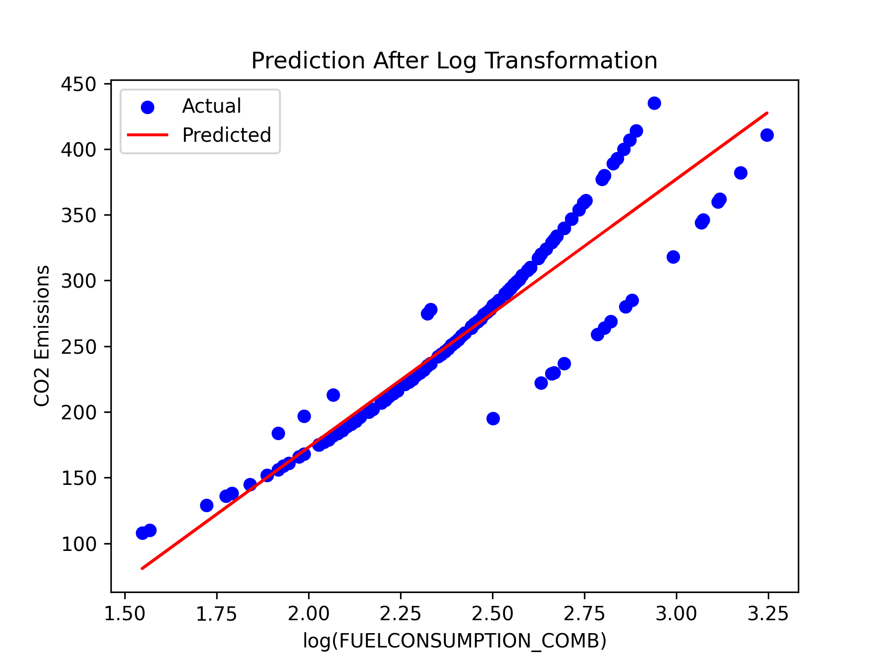

# 🚗 CO2 Emissions Prediction using Simple Linear Regression

This project demonstrates how simple linear regression can be used to predict vehicle CO2 emissions based on fuel consumption data. It also explores ways to improve model performance while staying within the scope of simple linear regression.

## 📌 Project Objective

Build a simple linear regression model to predict **CO2 emissions (g/km)** based on **vehicle fuel consumption**, and explore techniques to enhance performance without switching to more complex algorithms.

---

### 📊 Features Used

- `ENGINESIZE`
- `CYLINDERS`
- `FUELCONSUMPTION_COMB`
- `CO2EMISSIONS`

---

## ⚙️ Techniques Used

- **Data Preprocessing**: Checked for duplicates, missing values, and selected key features.
- **Data Visualization**: Used scatter plots & histograms to understand relationships.
- **Model Training**: Trained using scikit-learn’s `LinearRegression`.
- **Performance Evaluation**:
  - Mean Absolute Error (MAE)
  - Mean Squared Error (MSE)
  - Root Mean Squared Error (RMSE)
  - R² Score

---

## 🚀 Model Improvements

1. **Logarithmic Transformation**  
   Applied a log transformation to the `FUELCONSUMPTION_COMB` feature to:
   - Improve linearity between variables.
   - Reduce the effect of outliers.
   - Enhance interpretability and predictive power.

2. **Cross-Validation (K-Fold)**  
   Added 5-fold cross-validation for more robust evaluation.  
   Although the average R² score from cross-validation was slightly lower than the log-transformed model's R², it offers more reliable and generalizable insights as it averages across different data splits.

---

## 📈 Results Summary

| Model Variant           | MAE   | MSE   | RMSE  | R² Score |
|------------------------|-------|-------|-------|----------|
| Basic Regression       | 20.44 | 797.43| 28.24 | 0.81     |
| Log-Transformed        | 14.52 | 579.89| 24.08 | 0.86     |
| Cross-Validation (Log) |   —   |   —   |   —   | 0.84     |

> *Note*: Cross-validation only reports the average R² score across the 5 folds.

---

## 📸 Sample Visualizations

  
*Fuel Consumption vs CO2 Emissions (Raw)*

  
*Fuel Consumption vs CO2 Emissions (After Log Transformation)*

---

## 🛠 Requirements

- Python 3.x
- NumPy
- Pandas
- Matplotlib
- scikit-learn

## 📁 Folder Structure
```bash
.
├── Co2Cars.ipynb
├── co2cars.py
├── README.md
├── assets/
│   ├── before_log.png
│   └── after_log.png
└── FuelConsumptionCo2.csv


```
